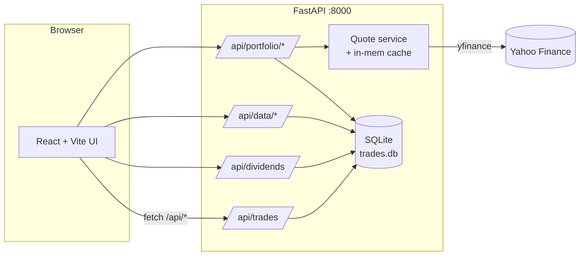

# Stock Tracker

A self-hosted portfolio tracker for **Taiwan** and **US** equities. Manual
trade entry, dividend tracking, live prices via Yahoo Finance, and a
fintech-style dashboard with cumulative earnings charts.

> Built because every off-the-shelf portfolio tracker either ignores
> Taiwanese tickers, charges money, or sends your trade history to a
> third party. This one runs on your laptop, stores everything in a local
> SQLite file, and the only outbound call is to fetch quotes from Yahoo.

---

## What you get

```
┌────────────────────────────────────────────────────────────────────┐
│ ◆ Stock Tracker          [Dashboard] Trades  Dividends  Data    ↻ │
├────────────────────────────────────────────────────────────────────┤
│ TWD Portfolio · 2 holdings                                         │
│                                                                    │
│ ┌─ TOTAL EARNED ──────────────────┐ ┌─ MARKET VALUE ─┐ ┌─ TODAY ─┐ │
│ │ NT$301,206.54                   │ │ NT$232,500.00  │ │ +NT$7.5k│ │
│ │ Realized 189,728 · Div 111,478  │ │ Cost: 90,050   │ │ +3.33%  │ │
│ └─────────────────────────────────┘ └────────────────┘ └─────────┘ │
│                                                                    │
│ CUMULATIVE EARNINGS                                                │
│                                          ■ Realized   NT$189,728   │
│                                          ■ Dividends  NT$111,478   │
│                                          ■ Total      NT$301,206   │
│ 300k│                                              ▄▄▄▄▄▄▄▄▄▄▄▄    │
│     │                                       ▄▄▄▄▄▄▄                │
│ 200k│                                ▄▄▄▄▄▄▄                       │
│     │                       ▄▄▄▄▄▄▄▄▄                              │
│ 100k│             ▄▄▄▄▄▄▄▄▄▄                                       │
│   0 │▄▄▄▄▄▄▄▄▄▄▄▄                                                  │
│     2023      2024      2025      2026                             │
│                                                                    │
│ HOLDINGS                                          ALLOCATION       │
│ Ticker   Shares  Avg Cost  Price    Value         ◐ 2330  78%      │
│ 2330      100    900.50   2,325   232,500         ◑ AAPL  22%      │
│ AAPL      10     150.60     287.51  2,875                          │
└────────────────────────────────────────────────────────────────────┘
```

### The four tabs

**Dashboard** — Hero "Total Earned" card, cumulative earnings chart
(stacked area: blue = realized P/L, amber = dividends), holdings table
with live prices, and allocation donut. Per-currency, no FX mixing.

**Trades** — Buy/sell entry form. List with ticker search, market filter
(TW/US), buy/sell filter, date-range presets (1M / 3M / 6M / 1Y / YTD /
Custom), inline editing, and pagination (10/20/50/100 per page).

**Dividends** — Dividend payout entry. Same filter and pagination
toolset as Trades. Currency auto-detected from the ticker.

**Data** — One-click CSV export and import for the whole portfolio.
"Last export" card shows when you last backed up, in relative time.
Drop a CSV at `backend/data/seed/portfolio.csv` and the backend auto-
loads it on first boot.

> **Want screenshots in this section?** Capture them and drop them into
> [`docs/screenshots/`](docs/screenshots/) following the filename
> convention there. The README will pick them up.

---

## Features

- **TW + US tickers** — bare 4-6 digit codes (e.g. `2330`) auto-resolve
  to `2330.TW`. Bond ETFs with letter suffixes (`00937B`, `00720B`) are
  supported. US tickers (`AAPL`, `MSFT`) pass through unchanged.
- **Live quotes** via Yahoo Finance with in-process caching (60 s for
  spot quotes, 5 min for daily history).
- **Per-currency P/L** — TWD and USD are kept separate (no FX
  conversion). Each currency gets its own summary card group, holdings
  table, and chart panel.
- **Hero "Total Earned" card** — the headline number (realized + dividends)
  with gradient styling, sized for at-a-glance reading.
- **Cumulative earnings chart** — stacked area showing realized P/L and
  dividends accumulated over time.
- **CSV import/export** — one unified file (`portfolio.csv`) with a
  `kind` column. Auto-load from a `seed/` folder on first boot.
- **Filtering** — ticker search, market (TW/US), date range with presets,
  trade type. Combine freely.
- **Inline editing** — click Edit on any row, fields become inputs, save
  or cancel. Backed by `PUT /api/{trades,dividends}/{id}`.
- **Pagination** — 10/20/50/100 per page with ellipsis and prev/next.
- **Last-export tracking** — Data tab shows when you last exported, both
  as a relative time ("3 hours ago") and the exact timestamp.

---

## Tech Stack

```
Backend                            Frontend
─────────────────                  ─────────────────
FastAPI                            Vite
SQLAlchemy 2.0  + SQLite           React 18 + TypeScript
yfinance                           Recharts (charts)
Pydantic                           Inter font
python-multipart                   Pure CSS (no framework)
```

---

## Architecture



---

## Project layout

```
backend/
  app/
    main.py            FastAPI app + CORS + seed-load on startup
    database.py        Trade, Dividend, Metadata SQLAlchemy models
    schemas.py         Pydantic request/response models
    routers/
      trades.py        CRUD + PUT for trades
      dividends.py     CRUD + PUT for dividends
      portfolio.py     holdings / summary / earnings-history / quote
      data.py          unified portfolio.csv import + export
    services/
      quotes.py        yfinance wrapper + ticker resolution + caching
      portfolio.py     avg-cost, realized P/L, daily earnings series
      csv_io.py        unified CSV parse + serialize
  data/trades.db       (auto-created, gitignored)
frontend/
  src/
    App.tsx            shell + Dashboard / Trades / Dividends / Data tabs
    api.ts             typed fetch client
    format.ts          money / percent / date / TW-detection helpers
    index.css          premium dark theme + Inter font
    components/
      PortfolioSummary.tsx    hero + per-currency cards
      PerformanceChart.tsx    stacked area earnings chart
      AllocationChart.tsx     donut chart
      HoldingsTable.tsx       open positions
      TradeForm.tsx           buy/sell entry form
      TradeList.tsx           filter + paginate + inline edit
      DividendForm.tsx        dividend entry form
      DividendList.tsx        filter + paginate + inline edit
      DataPanel.tsx           CSV import/export + last-export tracker
      Pagination.tsx          reusable page-size + page-number controls
```

---

## Quick start

### Backend

```powershell
cd backend
pip install -r requirements.txt
python -m uvicorn app.main:app --reload --port 8000
```

API docs: <http://127.0.0.1:8000/docs>

### Frontend

```powershell
cd frontend
npm install
npm run dev
```

Open <http://127.0.0.1:5173>. Vite proxies `/api/*` to the backend on `:8000`.

---

## How it works

- **Ticker resolution** — bare 4-6 digit codes (with optional letter
  suffix, e.g. `2330`, `00937B`) are queried as `…​.TW` against Yahoo
  Finance. Anything else (`AAPL`, `2330.TW`, `0050.TWO`) passes through
  unchanged.
- **Currencies** — TW symbols report TWD, everything else USD. Holdings,
  summaries, and the earnings chart are kept separate per currency (no
  FX conversion).
- **Cost basis** — weighted-average. Sells reduce the open cost basis
  proportionally and realize the difference vs. average price (minus
  fees).
- **Caching** — quotes 60 s, daily history 5 min, both in-process. No DB
  cache, so restarting the backend re-fetches.

---

## CSV import / export

The app uses **one unified CSV** for both trades and dividends. The
**Data** tab has Export and Import buttons.

Each row's `kind` column tells the backend whether it's a trade or a
dividend:

```
kind,type,ticker,shares,price,date,fee,amount,notes
trade,buy,2330,100,950,2024-01-15,28,,initial buy
trade,sell,2330,100,1100,2024-06-01,30,,closed
dividend,,2330,,,2024-08-15,,5,Q2 cash dividend
```

- For `kind=trade`: fill `type` (buy/sell), `shares`, `price`, `date`,
  `fee`, `notes` (optional). Leave `amount` blank.
- For `kind=dividend`: fill `ticker`, `date`, `amount`, `notes`
  (optional). Leave the trade-only columns blank.
- Dates accept `YYYY-MM-DD`, `YYYY/MM/DD`, or `MM/DD/YYYY`.
- Import always **appends** rows. To replace your data, delete from the
  UI first or remove `backend/data/trades.db`.

### Auto-seed on first boot

Drop a file at `backend/data/seed/portfolio.csv` and the backend loads
it on startup — **but only when both tables are empty.**

- First boot with no DB → the seed file is imported automatically.
- Once you have any data → the seed file is ignored (UI-entered data is
  never overwritten).
- To re-seed: delete `backend/data/trades.db`, then restart the backend.

---

## Endpoints

| Method | Path                                | Purpose                                  |
|--------|-------------------------------------|------------------------------------------|
| GET    | /api/health                         | liveness                                 |
| GET    | /api/trades                         | list trades, newest first                |
| POST   | /api/trades                         | create a trade                           |
| PUT    | /api/trades/{id}                    | update a trade                           |
| DELETE | /api/trades/{id}                    | delete a trade                           |
| GET    | /api/dividends                      | list dividends, newest first             |
| POST   | /api/dividends                      | create a dividend                        |
| PUT    | /api/dividends/{id}                 | update a dividend                        |
| DELETE | /api/dividends/{id}                 | delete a dividend                        |
| GET    | /api/data/export                    | download unified portfolio CSV           |
| POST   | /api/data/import                    | upload unified CSV (trades + dividends)  |
| GET    | /api/data/last-export               | timestamp of most recent export          |
| GET    | /api/portfolio/holdings             | per-ticker open positions + P/L          |
| GET    | /api/portfolio/summary              | per-currency totals incl. dividends      |
| GET    | /api/portfolio/history?days=N       | daily market value series (open holdings)|
| GET    | /api/portfolio/realized-history?days=N | daily cumulative realized P/L         |
| GET    | /api/portfolio/earnings-history?days=N | daily cumulative realized + dividends |
| GET    | /api/portfolio/quote/{ticker}       | spot quote (debug aid)                   |

---

## Privacy

- Your trade data lives in `backend/data/trades.db` (SQLite, on disk).
- The DB and any `seed/` files are in `.gitignore` — they're never
  pushed to GitHub.
- The only outbound network call is `yfinance` → Yahoo Finance for
  quotes. No analytics, no telemetry, no third-party storage.
