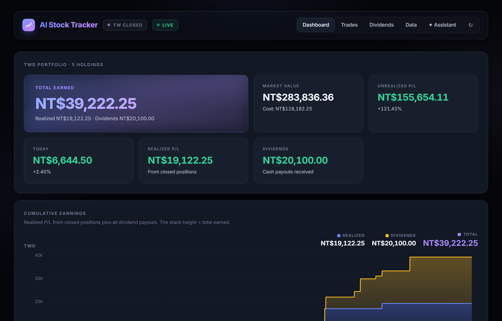
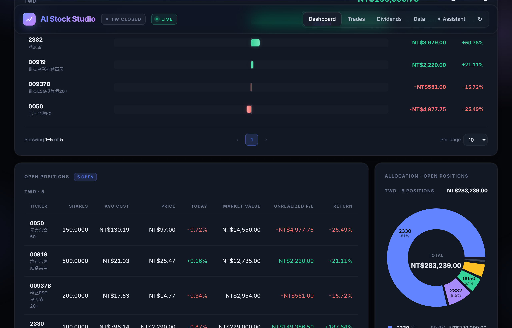
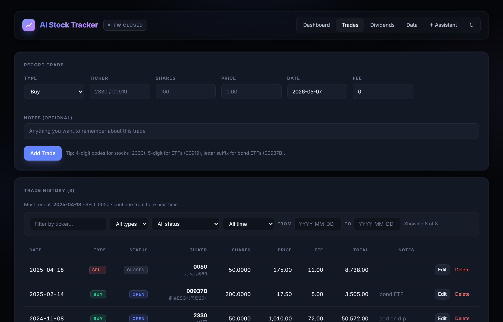
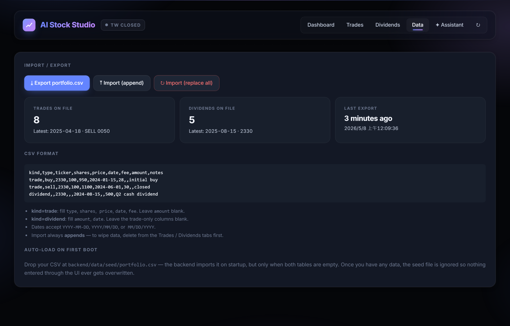
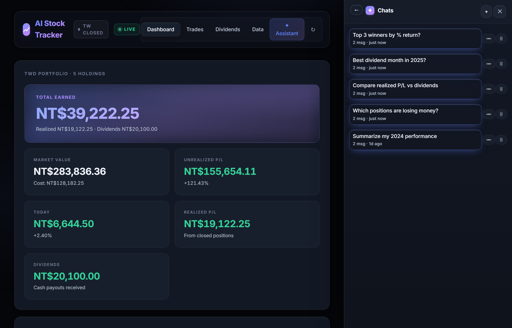
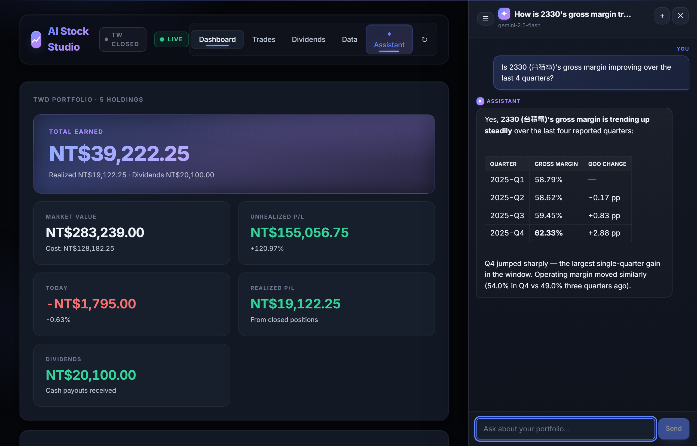
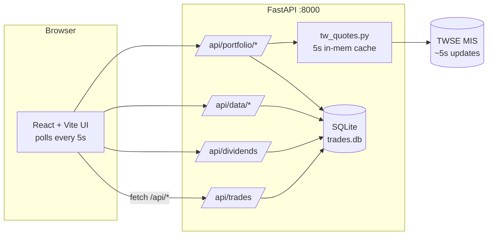

# AI Stock Tracker

A self-hosted portfolio tracker for **Taiwan equities** with
**near-real-time prices** during market hours, manual trade entry,
dividend tracking, and a fintech-style dashboard with stacked earnings
and unrealized-P/L charts.

> Built because every off-the-shelf portfolio tracker either ignores
> Taiwanese tickers, charges money, or sends your trade history to a
> third party. This one runs on your laptop, stores everything in a local
> SQLite file, and only talks to TWSE MIS (Taiwan exchange feed) for
> live quotes — no other outbound calls.

---

## Demo

### Dashboard

Live header with TW market status (open/closed) and a polling indicator.
Hero "Total Earned" card, summary grid with live unrealized P/L, and the
cumulative earnings chart with stacked Realized + Dividends.



### Unrealized P/L by position

Divergent horizontal bars showing each open holding's paper gain or
loss at the current market price. Sorted, color-coded green/red,
re-painted every 5 seconds while the dashboard is visible.



### Trades — filter, paginate, edit inline

Filter bar combining ticker search, market (TW/US), trade type, status
(open/closed), and a date range with quick presets. Stock names show
under each ticker. Pagination at the bottom; inline edit on every row.



### Data tab — CSV import / export with last-export tracking

One unified `portfolio.csv` for trades and dividends. Import always
appends; the "Last export" card shows when you last backed up, in
relative time.



### AI Assistant — persistent chat history sidebar

Slide-in sidebar (✦ Assistant button in the header) that does
natural-language Q&A over your local data via Google Gemini. Every
conversation is saved to SQLite — pick up where you left off, rename
threads, or delete the ones you don't want to keep.




---

## Features

- **All TW listings supported** — common stocks (4-digit, e.g. `2330`),
  ETFs (5-digit, e.g. `00919`), and bond ETFs with letter suffixes
  (`00937B`, `00720B`). Tickers auto-resolve to `xxxx.TW` against MIS.
- **Near-real-time prices** via the TWSE MIS endpoint — the same
  feed the exchange's own website uses. ~5-second granularity during
  09:00–13:30 Taipei time, weekdays.
- **Stock names** auto-pulled from MIS — `2330` shows `台積電` next
  to it on holdings, trades, dividends, allocation, and the entry forms.
- **Broker-matching P/L** — market values and unrealized P/L are gross
  (price × shares − cost), matching what most TW broker apps display
  under 總現值 / 損益試算. Note: brokers vary — some show gross like this,
  some deduct estimated sell-side fees. This app picks gross.
- **5-second polling** while the Dashboard tab is visible — pauses when
  you switch tabs, minimize, or navigate to another view; resumes on
  return.
- **Market status pill** — green `● TW OPEN` when the market is trading,
  grey `● TW CLOSED` outside hours; auto-flips at 09:00 / 13:30 Taipei.
- **TWD-only** — every position, summary, and chart is in NT$, no FX
  conversion to think about.
- **Hero "Total Earned" card** — the headline number (realized + dividends)
  with gradient styling, sized for at-a-glance reading.
- **Cumulative earnings chart** — stacked area showing realized P/L and
  dividends accumulated over time, per currency.
- **Unrealized P/L by position chart** — divergent horizontal bars,
  sorted by P/L, color-coded green/red. Live-updates with the polling.
- **FIFO open/closed status** — every trade is classified as still
  contributing to an open position or fully realized; filterable in
  the Trades tab.
- **CSV import/export** — one unified file (`portfolio.csv`) with a
  `kind` column. Auto-load from a `seed/` folder on first boot.
- **Filtering** — ticker search, trade type, open/closed status, date
  range with presets. Combine freely.
- **Inline editing** — click Edit on any row, fields become inputs, save
  or cancel. Backed by `PUT /api/{trades,dividends}/{id}`.
- **Pagination** — 10/20/50/100 per page with ellipsis and prev/next.
- **Last-export tracking** — Data tab shows when you last exported, both
  as a relative time ("3 hours ago") and the exact timestamp.

---

## Tech Stack

```
Backend                            Frontend
─────────────────                  ─────────────────
FastAPI                            Vite
SQLAlchemy 2.0  + SQLite           React 18 + TypeScript
TWSE MIS (live quotes)             Recharts (charts)
Pydantic                           Inter font
python-multipart                   Pure CSS (no framework)
```

---

## Architecture



---

## Project layout

```
backend/
  app/
    main.py            FastAPI app + CORS + seed-load on startup + .env
    database.py        Trade, Dividend, Metadata, Chat, ChatMessage models
    schemas.py         Pydantic request/response models
    routers/
      trades.py        CRUD + PUT + FIFO open/closed status per row
      dividends.py     CRUD + PUT for dividends
      portfolio.py     holdings / summary / earnings-history / names / quote
      data.py          unified portfolio.csv import + export
      ai.py            Gemini Q&A + persistent chat history (CRUD)
    services/
      quotes.py        thin wrapper exposing QuoteData + symbol resolution
      tw_quotes.py     TWSE MIS client (batched, 5s cache, name capture)
      portfolio.py     avg-cost, realized P/L, daily earnings series,
                       gross market value
      csv_io.py        unified CSV parse + serialize
  data/trades.db       (auto-created, gitignored)
frontend/
  src/
    App.tsx            shell + Dashboard / Trades / Dividends / Data tabs
    api.ts             typed fetch client
    format.ts          money / percent / date / TW-detection helpers
    index.css          premium dark theme + Inter font
    components/
      PortfolioSummary.tsx    hero + per-currency cards
      PerformanceChart.tsx    stacked area earnings chart (custom tooltip)
      UnrealizedChart.tsx     divergent bar chart, sorted by P/L
      AllocationChart.tsx     donut + custom legend with names
      HoldingsTable.tsx       open positions with live prices
      TradeForm.tsx           buy/sell entry with live name lookup
      TradeList.tsx           filter + paginate + inline edit + status
      DividendForm.tsx        dividend entry with live name lookup
      DividendList.tsx        filter + paginate + inline edit
      DataPanel.tsx           CSV import/export + last-export tracker
      MarketStatus.tsx        TW market open/closed pill
      Pagination.tsx          reusable page-size + page-number controls
      AssistantPanel.tsx      Gemini chat sidebar with persistent history
    hooks/
      useTickerName.ts        debounced ticker → name resolution
```

---

## Quick start

### Backend

```powershell
cd backend
pip install -r requirements.txt
python -m uvicorn app.main:app --reload --port 8000
```

API docs: <http://127.0.0.1:8000/docs>

### Frontend

```powershell
cd frontend
npm install
npm run dev
```

Open <http://127.0.0.1:5173>. Vite proxies `/api/*` to the backend on `:8000`.

---

## How it works

- **Ticker resolution** — bare 4-6 digit codes (with optional letter
  suffix, e.g. `2330`, `00919`, `00937B`) are queried as `xxxx.TW`
  against TWSE MIS.
- **Live quotes** — TW tickers go to TWSE MIS, batched into a single
  HTTP call per refresh (`tse_2330.tw|otc_00919.tw|...`). MIS returns
  both `tse_` (上市) and `otc_` (上櫃) listings; we probe both
  prefixes per ticker so callers don't need to know which exchange.
- **Cost basis** — weighted-average. Sells reduce the open cost basis
  proportionally and realize the difference vs. average price (minus
  fees).
- **Market value** — `current_price × shares`, gross. Matches the
  總現值 / 損益試算 fields in most TW broker apps. Note: a residual gap
  vs your broker is normal — MIS public feed lags broker-direct feeds
  by a few seconds and prices drift intraday.
- **Open vs closed status** — every trade is FIFO-matched per ticker:
  buys queue up; sells consume buy lots front-first; any buy lot with
  leftover shares is `open`, fully-consumed buys and all sells are
  `closed`.
- **Caching** — quotes 5 s in-process, daily history 5 min. No DB
  cache, so restarting the backend re-fetches.

### Live data flow

The Dashboard tab polls `/api/portfolio/{holdings,summary,earnings-history,names}`
every 5 seconds while it's the active view AND the browser tab is
visible. The backend's MIS cache (5s TTL) absorbs duplicate calls so
even with multiple browser tabs open you'll hit MIS once per 5s per
ticker batch, not once per browser request.

The header shows two pills:

- `● TW OPEN` (green, pulsing) when 09:00 ≤ Taipei time < 13:30 on
  weekdays. `● TW CLOSED` (grey) otherwise. Auto-flips at 09:00 and
  13:30; checks every 60 s.
- `● LIVE` (green, pulsing) appears whenever the polling loop is
  active. Disappears the moment you switch tabs, minimize, or
  navigate away from the Dashboard.

Outside market hours MIS returns the previous close, so the prices
look frozen — that's the data source, not a bug. The polling still
runs (and the LIVE pill still shows) so the moment 09:00 Taipei
arrives, prices start ticking automatically.

---

## CSV import / export

The app uses **one unified CSV** for both trades and dividends. The
**Data** tab has Export and Import buttons.

Each row's `kind` column tells the backend whether it's a trade or a
dividend:

```
kind,type,ticker,shares,price,date,fee,amount,notes
trade,buy,2330,100,950,2024-01-15,28,,initial buy
trade,sell,2330,100,1100,2024-06-01,30,,closed
dividend,,2330,,,2024-08-15,,5,Q2 cash dividend
```

- For `kind=trade`: fill `type` (buy/sell), `shares`, `price`, `date`,
  `fee`, `notes` (optional). Leave `amount` blank.
- For `kind=dividend`: fill `ticker`, `date`, `amount`, `notes`
  (optional). Leave the trade-only columns blank.
- Dates accept `YYYY-MM-DD`, `YYYY/MM/DD`, or `MM/DD/YYYY`.
- Import always **appends** rows. To replace your data, delete from the
  UI first or remove `backend/data/trades.db`.

### Auto-seed on first boot

Drop a file at `backend/data/seed/portfolio.csv` and the backend loads
it on startup — **but only when both tables are empty.**

- First boot with no DB → the seed file is imported automatically.
- Once you have any data → the seed file is ignored (UI-entered data is
  never overwritten).
- To re-seed: delete `backend/data/trades.db`, then restart the backend.

---

## Endpoints

| Method | Path                                | Purpose                                  |
|--------|-------------------------------------|------------------------------------------|
| GET    | /api/health                         | liveness                                 |
| GET    | /api/trades                         | list trades, newest first                |
| POST   | /api/trades                         | create a trade                           |
| PUT    | /api/trades/{id}                    | update a trade                           |
| DELETE | /api/trades/{id}                    | delete a trade                           |
| GET    | /api/dividends                      | list dividends, newest first             |
| POST   | /api/dividends                      | create a dividend                        |
| PUT    | /api/dividends/{id}                 | update a dividend                        |
| DELETE | /api/dividends/{id}                 | delete a dividend                        |
| GET    | /api/data/export                    | download unified portfolio CSV           |
| POST   | /api/data/import                    | upload unified CSV (trades + dividends)  |
| GET    | /api/data/last-export               | timestamp of most recent export          |
| GET    | /api/portfolio/holdings             | per-ticker open positions + live P/L     |
| GET    | /api/portfolio/summary              | TWD totals incl. dividends + total earned|
| GET    | /api/portfolio/names                | ticker → short-name map (e.g. 2330→台積電) |
| GET    | /api/portfolio/realized-history?days=N | daily cumulative realized P/L         |
| GET    | /api/portfolio/earnings-history?days=N | daily cumulative realized + dividends |
| GET    | /api/portfolio/quote/{ticker}       | live spot quote (price + name)           |
| GET    | /api/ai/status                      | whether GOOGLE_AI_API_KEY is configured  |
| POST   | /api/ai/chat                        | send a message; persists to SQLite        |
| GET    | /api/ai/chats                       | list saved conversations, newest first   |
| GET    | /api/ai/chats/{id}                  | fetch one conversation with all messages |
| PATCH  | /api/ai/chats/{id}                  | rename a conversation                    |
| DELETE | /api/ai/chats/{id}                  | delete a conversation (cascades messages)|

---

## AI assistant (optional)

The **✦ Assistant** button in the header opens a slide-in sidebar with
natural-language Q&A over your portfolio, powered by Google Gemini. It's
gated by an API key — without one the sidebar shows setup instructions
and the rest of the app works as normal.

### Setup (~30 seconds)

1. Visit <https://aistudio.google.com/apikey> and click **Create API key**.
   Free tier limits are generous (15 requests/minute on
   `gemini-2.5-flash`).
2. Copy `backend/.env.example` to `backend/.env` and paste in your key:

   ```
   GOOGLE_AI_API_KEY=AIza...
   ```

   `backend/.env` is gitignored, so the key never reaches GitHub.
3. Restart the backend. The sidebar now opens to a chat panel instead
   of the setup hint.

### Persistent chat history

Conversations are saved to SQLite (`chats` and `chat_messages` tables)
so they survive restarts and reloads:

- The first user message becomes the chat title (auto-truncated, can be
  renamed).
- Click **☰** in the sidebar header to see all saved chats with title,
  message count, and relative time. Click a row to switch into it.
- Hover any row for ✏ rename and 🗑 delete buttons.
- Click **+** to start a fresh chat without losing your history.
- The most recently viewed chat is restored automatically when you
  reopen the sidebar.

### What it can / can't do

- ✅ Answer questions about your local data: "what was my best dividend
  month in 2025?", "show me losing positions", "compare realized P/L
  vs dividends".
- ❌ Won't give buy/sell recommendations, predictions, or news. Try it
  and see — the system prompt forbids those answers.

### Privacy tradeoff

When you ask a question, your portfolio JSON (holdings, trades,
dividends, summary) is sent to Google's API for inference. Quotes from
TWSE MIS still happen locally. If you don't want any data going to
Google, leave `GOOGLE_AI_API_KEY` unset and the assistant stays
disabled — the rest of the app continues working.

> **Free tier note:** Google may use your prompts to improve their
> models on the free Gemini API tier. Switch to billing-enabled Vertex
> AI / Cloud if that's a dealbreaker.

---

## Privacy

- Your trade data lives in `backend/data/trades.db` (SQLite, on disk).
- The DB and any `seed/` files are in `.gitignore` — they're never
  pushed to GitHub.
- Outbound calls:
  - **TWSE MIS** (`https://mis.twse.com.tw`) — live quotes, always.
  - **Google AI** (`https://generativelanguage.googleapis.com`) — only
    when you've set `GOOGLE_AI_API_KEY` and ask a question in the
    Assistant tab.
- No analytics, no telemetry, no third-party storage.
